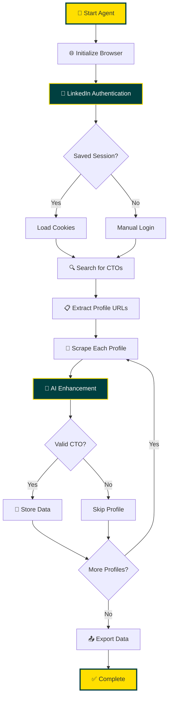

<div align="center">


# 🚀 LinkedIn CTO Intelligence Agent

### _Designed with passion for innovation_

**Automate CTO profile discovery and data extraction with AI-powered precision**

[](https://www.python.org/downloads/)
[](https://playwright.dev/)
[](https://openai.com/)
[](LICENSE)

[🌐 Website](https://hereandnowai.com) • [📧 Contact](mailto:info@hereandnowai.com) • [💼 LinkedIn](https://www.linkedin.com/company/hereandnowai/) • [📱 +91 996 296 1000](tel:+919962961000)

---

</div>

## 🎯 What is This?

The **LinkedIn CTO Intelligence Agent** by HERE AND NOW AI is a cutting-edge automation tool that revolutionizes how you discover and analyze technology leadership talent. Using advanced browser automation and AI-powered data extraction, this agent intelligently scrapes CTO profiles from LinkedIn, providing structured, actionable insights for:

- 🎯 **Talent Acquisition**: Find the perfect CTO for your startup or enterprise
- � **Market Research**: Analyze technology leadership trends across industries
- 🤝 **Business Development**: Identify decision-makers for enterprise sales
- 💡 **Competitive Intelligence**: Understand the tech leadership landscape
- 🔗 **Network Building**: Discover and connect with technology executives

## ✨ Why Choose Our Agent?

### � **AI-Powered Intelligence**

Leverages OpenAI's GPT-4 to intelligently extract, normalize, and enrich profile data with human-like understanding.

### 🛡️ **Stealth Technology**

Advanced anti-detection measures including:

- Human-like behavior patterns and random delays
- Session persistence with cookie management
- Realistic scrolling and mouse movements
- Configurable rate limiting

### � **Production-Ready**

Built with enterprise-grade reliability:

- Incremental backups every 5 profiles
- Graceful error handling and recovery
- Comprehensive logging system
- Multiple export formats (JSON, CSV)

### 🎨 **Easy to Use**

Simple CLI interface with powerful options:

```bash
python main.py --max-profiles 20 --keywords "CTO" "VP Technology"
```

## 🌟 Key Features

<table>
<tr>
<td width="50%">

### 🔍 **Smart Discovery**

- Keyword-based CTO search
- Company-specific targeting
- Direct URL scraping
- Automatic profile validation

### 🤖 **AI Enhancement**

- Intelligent data normalization
- Years of experience estimation
- Top skills identification
- Professional summary generation

</td>
<td width="50%">

### � **Rich Data Export**

- JSON for API integration
- CSV for spreadsheet analysis
- Automatic deduplication
- Incremental backup system

### ⚡ **Performance**

- Async/await architecture
- Parallel processing ready
- Session persistence
- Optimized for scale

</td>
</tr>
</table>

## 📊 Data Extracted

Extract comprehensive CTO profiles including:

| Category         | Fields                                                 |
| ---------------- | ------------------------------------------------------ |
| **Basic Info**   | Name, Headline, Location, Profile URL                  |
| **Professional** | Current Company, Position, Years of Experience         |
| **Experience**   | Work History (top 5 positions)                         |
| **Education**    | Academic Background (top 3 entries)                    |
| **Skills**       | Technical Skills (top 10)                              |
| **AI-Enhanced**  | Normalized job title, Key skills, Professional summary |
| **Metadata**     | Scrape timestamp, CTO validation status                |

## 🚀 Quick Start

### Prerequisites

- Python 3.8 or higher
- LinkedIn account
- OpenAI API key (optional but recommended)

### Installation

```bash
# Clone the repository
git clone https://github.com/hereandnowai/linkedin-cto-agent.git
cd linkedin-cto-agent

# Create virtual environment
python3 -m venv venv
source venv/bin/activate

# Install dependencies
pip install -r requirements.txt

# Install Playwright browsers
playwright install chromium

# Configure (optional)
cp .env.example .env
# Edit .env with your credentials
```

### Basic Usage

```bash
# Scrape 10 CTO profiles
python main.py --max-profiles 10

# Custom keywords
python main.py --keywords "CTO" "Chief Technology Officer" "VP Engineering"

# Scrape specific URLs
python main.py --urls "https://linkedin.com/in/profile1" "https://linkedin.com/in/profile2"

# Export to JSON only
python main.py --max-profiles 20 --format json
```

See [QUICKSTART.md](QUICKSTART.md) for detailed instructions.

## 📖 How It Works



## 🎛️ Advanced Configuration

### Environment Variables

```env
# LinkedIn Credentials
LINKEDIN_EMAIL=your-email@example.com
LINKEDIN_PASSWORD=your-password

# OpenAI API (enables AI enhancement)
OPENAI_API_KEY=sk-your-api-key-here

# Rate Limiting (adjust for safety)
MIN_DELAY_SECONDS=3
MAX_DELAY_SECONDS=7
MAX_PROFILES_PER_SESSION=50
```

### CLI Options

| Option                     | Description              | Example                        |
| -------------------------- | ------------------------ | ------------------------------ |
| `--max-profiles N`         | Limit number of profiles | `--max-profiles 50`            |
| `--keywords K1 K2`         | Custom search terms      | `--keywords "CTO" "VP Tech"`   |
| `--format {json,csv,both}` | Export format            | `--format json`                |
| `--urls URL1 URL2`         | Specific profiles        | `--urls "linkedin.com/in/..."` |
| `--no-validate`            | Skip CTO validation      | `--no-validate`                |

## � Use Cases

### 🏢 **Recruitment Agencies**

Build comprehensive databases of technology leadership talent for client placements.

### 💼 **Executive Search Firms**

Identify and analyze CTO candidates across specific industries or company sizes.

### 📈 **Market Intelligence**

Research technology leadership trends, skills, and background patterns.

### 🚀 **Startups**

Find and connect with potential technical co-founders or advisors.

### 🔬 **Academic Research**

Study career trajectories and educational backgrounds of technology executives.

## ⚠️ Important Disclaimer

> **Educational Purpose Only**
>
> This tool is provided for educational and research purposes. Using this tool may violate LinkedIn's Terms of Service and could result in account suspension. HERE AND NOW AI is not responsible for any misuse of this software. Users are advised to:
>
> - Review LinkedIn's Terms of Service
> - Only scrape publicly available information
> - Respect rate limits and privacy
> - Consider using LinkedIn's official API for commercial applications
> - Use at your own risk

## �️ Troubleshooting

<details>
<summary><b>Login Issues</b></summary>

- Verify credentials in `.env` file
- Complete CAPTCHA manually if prompted
- Try non-headless mode: `HEADLESS=False` in `config.py`
- Clear cookies: Delete `cookies/linkedin_session.json`
</details>

<details>
<summary><b>No Profiles Found</b></summary>

- Try different search keywords
- Verify LinkedIn account has search access
- Check you're successfully logged in
- Ensure your account isn't restricted
</details>

<details>
<summary><b>Rate Limiting Warnings</b></summary>

- Reduce `MAX_PROFILES_PER_SESSION`
- Increase delay intervals in `.env`
- Space out scraping sessions over days
- Use more conservative settings
</details>

<details>
<summary><b>AI Extraction Errors</b></summary>

- Verify OpenAI API key is valid
- Check API credit balance
- Agent falls back to basic extraction automatically
- Review logs in `logs/` directory
</details>

## � Support & Contact

<div align="center">

### Connect with HERE AND NOW AI

🌐 [Website](https://hereandnowai.com) | 📧 [Email](mailto:info@hereandnowai.com) | 📱 [+91 996 296 1000](tel:+919962961000)

[](https://www.linkedin.com/company/hereandnowai/)
[](https://instagram.com/hereandnow_ai)
[](https://github.com/hereandnowai)
[](https://x.com/hereandnow_ai)
[](https://youtube.com/@hereandnow_ai)

📝 [Read our Blog](https://hereandnowai.com/blog) for AI insights and tutorials

</div>

## 🤝 Contributing

We welcome contributions! This project is open for:

- 🐛 Bug reports and fixes
- ✨ Feature requests and implementations
- 📚 Documentation improvements
- 🧪 Testing and quality assurance

## 📄 License

This project is licensed under the MIT License - see the [LICENSE](LICENSE) file for details.

## 🙏 Acknowledgments

Built with powerful open-source technologies:

- [Playwright](https://playwright.dev/) - Modern browser automation
- [OpenAI GPT-4](https://openai.com/) - AI-powered data extraction
- [Pandas](https://pandas.pydata.org/) - Data manipulation and export
- [BeautifulSoup4](https://www.crummy.com/software/BeautifulSoup/) - HTML parsing

## 🌟 Star Us!

If you find this project useful, please ⭐ star this repository and share it with others!

---

<div align="center">

**HERE AND NOW AI** - _Designed with passion for innovation_

Made with ❤️ for the AI community

</div>
